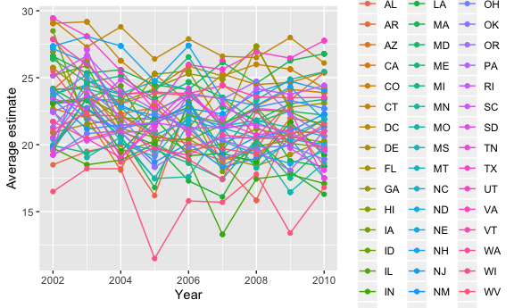
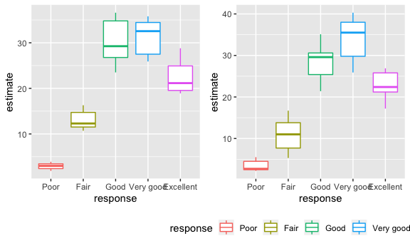
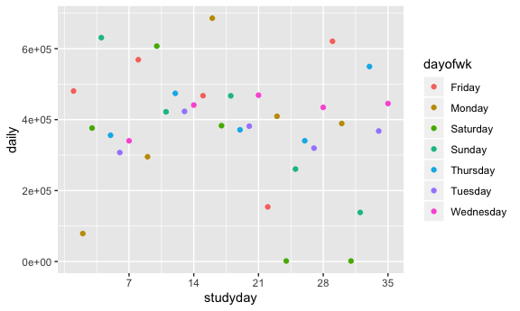

p8105\_hw2\_az2356
================
Amelia Zhao
9/19/2019

# This is my markdown file for Homework 3.

# Problem 1.

Loading the instacart data & looking at the contents &
    structure:

``` r
library(tidyverse)
```

    ## ── Attaching packages ───────────────────────────────────────────────────── tidyverse 1.2.1 ──

    ## ✔ ggplot2 3.2.1          ✔ purrr   0.3.2     
    ## ✔ tibble  2.1.3          ✔ dplyr   0.8.3     
    ## ✔ tidyr   1.0.0.9000     ✔ stringr 1.4.0     
    ## ✔ readr   1.3.1          ✔ forcats 0.4.0

    ## ── Conflicts ──────────────────────────────────────────────────────── tidyverse_conflicts() ──
    ## ✖ dplyr::filter() masks stats::filter()
    ## ✖ dplyr::lag()    masks stats::lag()

``` r
library(p8105.datasets)
library(ggplot2)
library(devtools)
```

    ## Loading required package: usethis

``` r
install_github("thomasp85/patchwork")
```

    ## Skipping install of 'patchwork' from a github remote, the SHA1 (36b49187) has not changed since last install.
    ##   Use `force = TRUE` to force installation

``` r
library(patchwork)
data("instacart")

instacart %>% 
  group_by(aisle) %>% 
  summarize(orders = n())
```

    ## # A tibble: 134 x 2
    ##    aisle                  orders
    ##    <chr>                   <int>
    ##  1 air fresheners candles   1067
    ##  2 asian foods              7007
    ##  3 baby accessories          306
    ##  4 baby bath body care       328
    ##  5 baby food formula       13198
    ##  6 bakery desserts          1501
    ##  7 baking ingredients      13088
    ##  8 baking supplies decor    1094
    ##  9 beauty                    287
    ## 10 beers coolers            1839
    ## # … with 124 more rows

The instacart file contains data on orders for 49,688 grocery products,
from 206,209 users. The data set can be easily viewed sorting by order
IDs, user IDs, or product IDs for ease of access.

For each user and their respective order(s), there is information on the
order in which they added products to their cart, whether a product is a
repeat order for them, how many times they has ordered before, the day
and time of their order, and how many day it’s been since they last
ordered.

For each product, there is information on the product name, as well as
the corresponding department and aisle, both numerically (Aisle 2) and
qualitatively (Specialty Cheeses, yum).

For example, we can see that the account for User ID 79431 placed an
order on Friday at 6pm for Grated Pecorino Romano Cheese; Spring Water;
Organic Half & Half; Super Greens Salad; Cage Free Extra Large Grade AA
Eggs; Prosciutto, Americano; Organic Garnet Sweet Potato (Yam);
Asparagus, added in that order to their cart. Yay for yams\! Boo for
bottled water.

There are 134 aisles, with the most popular ordered from being Aisle 83,
the Fresh Vegetables aisle, with 150,609 items ordered\! The second most
popular aisle ordered from is the Fresh Fruits aisle, with 150,473 items
ordered\! Glad to see instacart users eating healthy\!

Making a plot showing the number of items ordered in each aisle, for
aisles with more than 10000 items ordered.

``` r
knitr::opts_chunk$set(
  fig.width = 6,
  fig.asp = .6,
  out.width = "90%"
)

instacart %>%
  group_by(aisle) %>%
  count(aisle_id) %>% 
  filter(n > 10000) %>% 
  ggplot(aes(x = aisle_id, y = n, color = aisle_id)) + 
    geom_point() + labs(
      title = "Items Ordered per Grocery Aisle", 
      x = "Aisle ID",
      y = "Number of Orders") 
```

<!-- -->

Making a table showing the three most popular items in each of the
aisles “baking ingredients”, “dog food care”, and “packaged vegetables
fruits”, with the number of times each item is ordered.

``` r
instacart %>% 
  group_by(aisle) %>%
  filter(aisle == "baking ingredients" | aisle == "dog food care" | aisle ==  "packaged vegetables fruits") %>% 
  count(product_name) %>% 
  filter(min_rank(desc(n)) < 4) %>% 
  rename("Number of orders" = n, "Product Name" = product_name, "Aisle" = aisle) %>% 
  knitr::kable(caption = "The Top 3 Items in the 3 Most Interesting Aisles")
```

| Aisle                      | Product Name                                  | Number of orders |
| :------------------------- | :-------------------------------------------- | ---------------: |
| baking ingredients         | Cane Sugar                                    |              336 |
| baking ingredients         | Light Brown Sugar                             |              499 |
| baking ingredients         | Pure Baking Soda                              |              387 |
| dog food care              | Organix Chicken & Brown Rice Recipe           |               28 |
| dog food care              | Small Dog Biscuits                            |               26 |
| dog food care              | Snack Sticks Chicken & Rice Recipe Dog Treats |               30 |
| packaged vegetables fruits | Organic Baby Spinach                          |             9784 |
| packaged vegetables fruits | Organic Blueberries                           |             4966 |
| packaged vegetables fruits | Organic Raspberries                           |             5546 |

The Top 3 Items in the 3 Most Interesting Aisles

Making a 2x7 table showing the mean hour of the day at which Pink Lady
Apples and Coffee Ice Cream are ordered on each day of the week.

``` r
instacart %>% 
  mutate(order_dow = recode(order_dow, 
    "0" = "Sunday", 
    "1" = "Monday", "2" = "Tuesday", "3" = "Wednesday", "4" = "Thursday", "5" = "Friday", "6" = "Saturday"),
    ) %>% 
  group_by(product_name, order_dow) %>%
  filter(product_name == "Pink Lady Apples" | product_name == "Coffee Ice Cream") %>% 
  summarize(
    meanhr = mean(order_hour_of_day)
    ) %>% 
  pivot_wider(
    names_from = "order_dow",
    values_from = "meanhr"
    ) %>% 
  rename(Product = product_name) %>% 
  knitr::kable(caption = "Mean Hour (24h) of Coffee Ice Cream and Pink Lady Apple Orders") 
```

| Product          |   Friday |   Monday | Saturday |   Sunday | Thursday |  Tuesday | Wednesday |
| :--------------- | -------: | -------: | -------: | -------: | -------: | -------: | --------: |
| Coffee Ice Cream | 12.26316 | 14.31579 | 13.83333 | 13.77419 | 15.21739 | 15.38095 |  15.31818 |
| Pink Lady Apples | 12.78431 | 11.36000 | 11.93750 | 13.44118 | 11.55172 | 11.70213 |  14.25000 |

Mean Hour (24h) of Coffee Ice Cream and Pink Lady Apple Orders

# Problem 2

Data from the Behavioral Risk Factors Surveillance System for Selected
Metropolitan Area Risk Trends (SMART) for 2002-2010. Cleaning the data:

``` r
library(p8105.datasets)
data("brfss_smart2010")

brfss <-
  brfss_smart2010 %>% 
  janitor::clean_names(case = c("snake")) %>% 
  rename(
    state = locationabbr,
    county = locationdesc,
    estimate = data_value,
    estimate_type = data_value_type
  ) %>% 
  select(-location_id) %>% 
  group_by(topic) %>% 
  filter(response == "Excellent" | response == "Very good" | response == "Good" | response == "Fair" | response == "Poor") %>% 
  mutate(
    response = factor(response, levels = c("Poor", "Fair", "Good", "Very good", "Excellent"))
  )


brfss %>% 
  group_by(year, state) %>% 
  summarize(n = n_distinct(county)) %>% 
  filter(year == 2002, n > 6) 
```

    ## # A tibble: 6 x 3
    ## # Groups:   year [1]
    ##    year state     n
    ##   <int> <chr> <int>
    ## 1  2002 CT        7
    ## 2  2002 FL        7
    ## 3  2002 MA        8
    ## 4  2002 NC        7
    ## 5  2002 NJ        8
    ## 6  2002 PA       10

``` r
brfss %>% 
  group_by(year, state) %>% 
  summarize(n = n_distinct(county)) %>% 
  filter(year == 2010, n > 6) 
```

    ## # A tibble: 14 x 3
    ## # Groups:   year [1]
    ##     year state     n
    ##    <int> <chr> <int>
    ##  1  2010 CA       12
    ##  2  2010 CO        7
    ##  3  2010 FL       41
    ##  4  2010 MA        9
    ##  5  2010 MD       12
    ##  6  2010 NC       12
    ##  7  2010 NE       10
    ##  8  2010 NJ       19
    ##  9  2010 NY        9
    ## 10  2010 OH        8
    ## 11  2010 PA        7
    ## 12  2010 SC        7
    ## 13  2010 TX       16
    ## 14  2010 WA       10

In 2002, there were 6 states that were observed at 7 or more locations,
compared to 14 states in 2010.

``` r
excellent <- 
  brfss %>% 
  filter(response == "Excellent") %>% 
  group_by(state, year) %>% 
  mutate(
    avgest = mean(estimate),
    avgest = round(avgest, digits = 2)
  ) %>% 
  select(year, state, avgest)

ggplot(data = excellent, aes(x = year, y = avgest, group = state, colour = state)) + geom_point() + geom_line() + labs(
      x = "Year",
      y = "Average estimate") 
```

    ## Warning: Removed 71 rows containing missing values (geom_point).

    ## Warning: Removed 65 rows containing missing values (geom_path).



``` r
plot1 = 
  brfss %>% 
  group_by(response) %>% 
  filter(year == 2006, state == "NY") %>% 
  ggplot(aes(x = response, y = estimate, color = response)) + geom_boxplot() + theme(legend.position = "none")

plot2 = 
  brfss %>% 
  group_by(response) %>% 
  filter(year == 2010, state == "NY") %>% 
  ggplot(aes(x = response, y = estimate, color = response)) + geom_boxplot() + theme(legend.position = "bottom")

(plot1 + plot2)
```



# Problem 3

Loading, tidying, wrangling the data:

``` r
"./data/accel_data.csv"
```

    ## [1] "./data/accel_data.csv"

``` r
accel <- 
  read_csv("data/accel_data.csv") %>% 
  rename('dayofwk' = day, studyday = day_id) %>% 
  mutate(wkdaywkend = case_when(
      dayofwk == "Monday" ~ "weekday",
      dayofwk == "Tuesday" ~ "weekday",
      dayofwk == "Wednesday" ~ "weekday",
      dayofwk == "Thursday" ~ "weekday",
      dayofwk == "Friday" ~ "weekday",
      dayofwk == "Saturday" ~ "weekend",
      dayofwk == "Sunday" ~ "weekend"
      )) %>% 
  mutate_if(is.numeric, round, digits = 2) %>% 
  janitor::clean_names(dat = ., case = c("snake")) 
```

    ## Parsed with column specification:
    ## cols(
    ##   .default = col_double(),
    ##   day = col_character()
    ## )

    ## See spec(...) for full column specifications.

The accelerometer dataset contains activity data from every minute of
the day for 35 days for one individual aged 63 with BMI 25.
Additionally, there are variables for the day of the week, as well as
whether the day was a weekend or weekday.

``` r
plotdata = 
  accel %>% 
  pivot_longer(activity_1:activity_1440,
              names_to = "activity_minute",
               values_to = "activity") %>% 
    group_by(studyday, dayofwk) %>% 
  summarise(daily = sum(activity))


  ggplot(data = plotdata, aes(x = studyday, y = daily, color = dayofwk)) + geom_point() + scale_x_continuous(breaks = c(7, 14, 21, 28, 35)) 
```



``` r
plotdata %>% 
  knitr::kable()
```

| studyday | dayofwk   |     daily |
| -------: | :-------- | --------: |
|        1 | Friday    | 480542.61 |
|        2 | Monday    |  78828.18 |
|        3 | Saturday  | 376254.00 |
|        4 | Sunday    | 631105.00 |
|        5 | Thursday  | 355923.72 |
|        6 | Tuesday   | 307094.19 |
|        7 | Wednesday | 340115.01 |
|        8 | Friday    | 568839.00 |
|        9 | Monday    | 295431.00 |
|       10 | Saturday  | 607175.00 |
|       11 | Sunday    | 422018.00 |
|       12 | Thursday  | 474048.00 |
|       13 | Tuesday   | 423245.00 |
|       14 | Wednesday | 440962.00 |
|       15 | Friday    | 467420.00 |
|       16 | Monday    | 685910.00 |
|       17 | Saturday  | 382928.00 |
|       18 | Sunday    | 467052.00 |
|       19 | Thursday  | 371230.00 |
|       20 | Tuesday   | 381507.00 |
|       21 | Wednesday | 468869.00 |
|       22 | Friday    | 154049.00 |
|       23 | Monday    | 409450.00 |
|       24 | Saturday  |   1440.00 |
|       25 | Sunday    | 260617.00 |
|       26 | Thursday  | 340291.00 |
|       27 | Tuesday   | 319568.00 |
|       28 | Wednesday | 434460.00 |
|       29 | Friday    | 620860.00 |
|       30 | Monday    | 389080.00 |
|       31 | Saturday  |   1440.00 |
|       32 | Sunday    | 138421.00 |
|       33 | Thursday  | 549658.00 |
|       34 | Tuesday   | 367824.00 |
|       35 | Wednesday | 445366.00 |

Based on the daily total activity data presented in the table, there
don’t seem to be any trends present. This man’s activity fluctuates
greatly, from 1440 on a Saturday to 685910 on a Monday\!

Additionally, based on the plot showing the 24-hour activity time
courses for each day, there doesn’t seem to be a consistent relationship
between day of the week and activity. On Tuesdays, shown in purple on
the plot, our guy seems to typically have the same amount of activity,
but on Mondays (shown in burnt yellow) and Saturdays (shown in dark
green), his activity fluctuates greatly. In particular, he had two lazy
Saturdays in the 4th and 5th weeks of observation. Or, he could have
forgotten to wear the accelerometer on these days. I’ll choose to
believe that he had lazy Saturdays and live vicariously through him.
