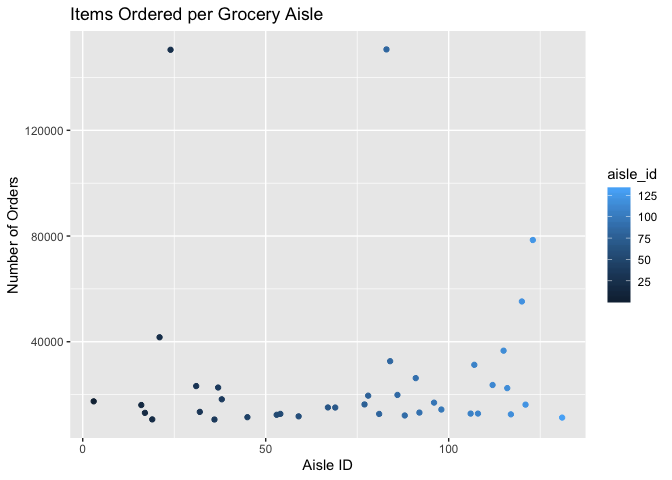

p8105\_hw2\_az2356
================
Amelia Zhao
9/19/2019

# This is my markdown file for Homework 3.

# Problem 1.

Loading the instacart data & looking at the contents &
    structure:

``` r
library(tidyverse)
```

    ## ── Attaching packages ───────────────────────────────── tidyverse 1.2.1 ──

    ## ✔ ggplot2 3.2.1          ✔ purrr   0.3.2     
    ## ✔ tibble  2.1.3          ✔ dplyr   0.8.3     
    ## ✔ tidyr   1.0.0.9000     ✔ stringr 1.4.0     
    ## ✔ readr   1.3.1          ✔ forcats 0.4.0

    ## ── Conflicts ──────────────────────────────────── tidyverse_conflicts() ──
    ## ✖ dplyr::filter() masks stats::filter()
    ## ✖ dplyr::lag()    masks stats::lag()

``` r
library(p8105.datasets)
data("instacart")

instacart %>% 
  group_by(aisle) %>% 
  summarize(orders = n())
```

    ## # A tibble: 134 x 2
    ##    aisle                  orders
    ##    <chr>                   <int>
    ##  1 air fresheners candles   1067
    ##  2 asian foods              7007
    ##  3 baby accessories          306
    ##  4 baby bath body care       328
    ##  5 baby food formula       13198
    ##  6 bakery desserts          1501
    ##  7 baking ingredients      13088
    ##  8 baking supplies decor    1094
    ##  9 beauty                    287
    ## 10 beers coolers            1839
    ## # … with 124 more rows

The instacart file contains data on orders for 49,688 grocery products,
from 206,209 users. The data set can be easily viewed sorting by order
IDs, user IDs, or product IDs for ease of access.

For each user and their respective order(s), there is information on the
order in which they added products to their cart, whether a product is a
repeat order for them, how many times they has ordered before, the day
and time of their order, and how many day it’s been since they last
ordered.

For each product, there is information on the product name, as well as
the corresponding department and aisle, both numerically (Aisle 2) and
qualitatively (Specialty Cheeses, yum).

For example, we can see that the account for User ID 79431 placed an
order on Friday at 6pm for Grated Pecorino Romano Cheese; Spring Water;
Organic Half & Half; Super Greens Salad; Cage Free Extra Large Grade AA
Eggs; Prosciutto, Americano; Organic Garnet Sweet Potato (Yam);
Asparagus, added in that order to their cart. Yay for yams\! Boo for
bottled water.

There are 134 aisles, with the most popular ordered from being Aisle 83,
the Fresh Vegetables aisle, with 150,609 items ordered\! The second most
popular aisle ordered from is the Fresh Fruits aisle, with 150,473 items
ordered\! Glad to see instacart users eating healthy\!

Making a plot showing the number of items ordered in each aisle, for
aisles with more than 10000 items ordered.

``` r
knitr::opts_chunk$set(
  fig.width = 6,
  fig.asp = .6,
  out.width = "90%"
)

instacart %>%
  group_by(aisle) %>%
  count(aisle_id) %>% 
  filter(n > 10000) %>% 
  ggplot(aes(x = aisle_id, y = n, color = aisle_id)) + 
    geom_point() + labs(
      title = "Items Ordered per Grocery Aisle", 
      x = "Aisle ID",
      y = "Number of Orders") 
```

<!-- -->

Making a table showing the three most popular items in each of the
aisles “baking ingredients”, “dog food care”, and “packaged vegetables
fruits”, with the number of times each item is ordered.

``` r
instacart %>% 
  group_by(aisle) %>%
  filter(aisle == "baking ingredients" | aisle == "dog food care" | aisle ==  "packaged vegetables fruits") %>% 
  count(product_name) %>% 
  filter(min_rank(desc(n)) < 4) %>% 
  rename("Number of orders" = n, "Product Name" = product_name, "Aisle" = aisle) %>% 
  knitr::kable(caption = "The Top 3 Items in the 3 Most Interesting Aisles")
```

| Aisle                      | Product Name                                  | Number of orders |
| :------------------------- | :-------------------------------------------- | ---------------: |
| baking ingredients         | Cane Sugar                                    |              336 |
| baking ingredients         | Light Brown Sugar                             |              499 |
| baking ingredients         | Pure Baking Soda                              |              387 |
| dog food care              | Organix Chicken & Brown Rice Recipe           |               28 |
| dog food care              | Small Dog Biscuits                            |               26 |
| dog food care              | Snack Sticks Chicken & Rice Recipe Dog Treats |               30 |
| packaged vegetables fruits | Organic Baby Spinach                          |             9784 |
| packaged vegetables fruits | Organic Blueberries                           |             4966 |
| packaged vegetables fruits | Organic Raspberries                           |             5546 |

The Top 3 Items in the 3 Most Interesting Aisles

Making a 2x7 table showing the mean hour of the day at which Pink Lady
Apples and Coffee Ice Cream are ordered on each day of the week.

# Problem 2

``` r
library(p8105.datasets)
data("brfss_smart2010")
```

# Problem 3

``` r
"./data/accel_data.csv"
```

    ## [1] "./data/accel_data.csv"

``` r
accel <- 
  read_csv("data/accel_data.csv")
```

    ## Parsed with column specification:
    ## cols(
    ##   .default = col_double(),
    ##   day = col_character()
    ## )

    ## See spec(...) for full column specifications.
